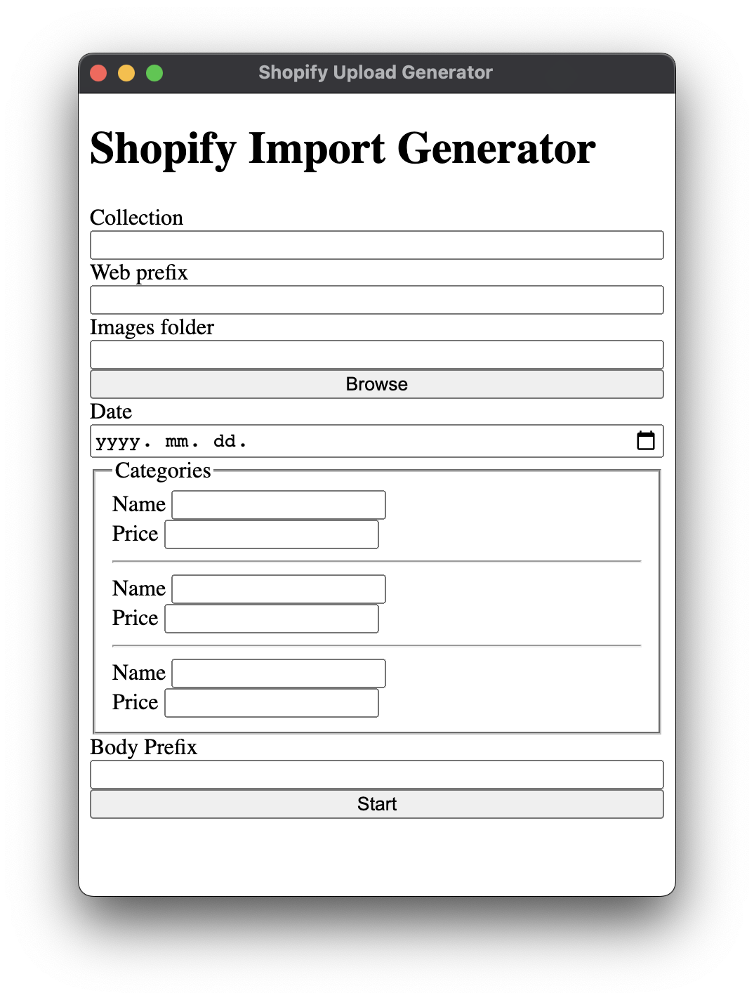

# Shopify Uploader

Bulk Shopify uploader that works by generating an import CSV

## Usage

### 1. Install

```bash
yarn install
```

### 2. Start

```bash
yarn start
```

### 3. Adjust settings and press start



### 4. Upload images

Upload the images to the specified web URL.

You need your server to temporarily store the objects.

### 5. Upload CSV

Go to the Shopify admin panel and in the products menu select: import. Upload the CSV file and wait for it to finish the upload.

### 6. Remove images

After all of the products have been uploaded you may remove them from the server.

## Limitations

- A public server is needed for the image upload
- Only supports one product per image
- All products will have the same price
- A collection is required for the images
